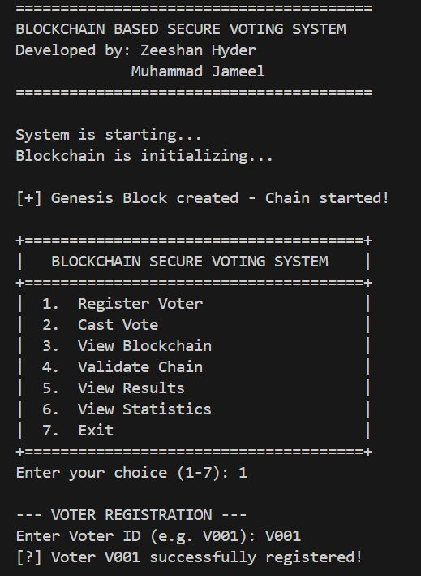
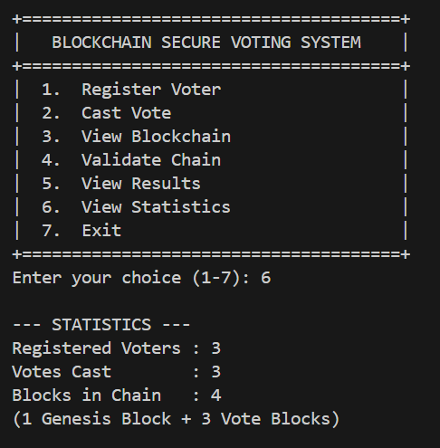
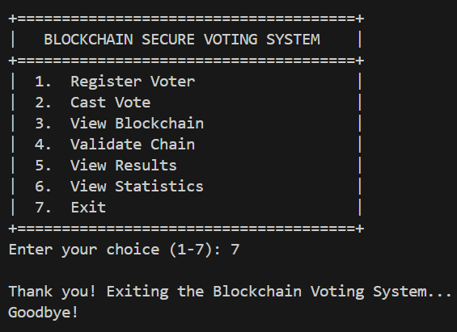

# Blockchain-Voting-System
🗳️ A tamper-proof electronic voting system using blockchain principles. Implements hashing, chaining, and encryption in pure Java. Features voter registration, one-person-one-vote, real-time result tallying, and chain validation. Perfect for understanding blockchain core concepts.

```markdown
# 🗳️ Blockchain-Based Secure Voting System

[](https://java.com)
[](https://opensource.org/licenses/MIT)

## 📌 Overview

This project is a **secure electronic voting system** that uses **blockchain principles** to ensure transparency, immutability, and trust. Each vote is stored as a **block** containing an encrypted voter ID, candidate name, timestamp, and a unique hash that links it to the previous block. Any attempt to tamper with a vote breaks the hash chain and is immediately detected.

> Built as a college project to demonstrate **Java OOP concepts** + **blockchain fundamentals** in a real-world application.

---

## ✨ Features

| Feature | Description |
|---------|-------------|
| 🔗 **Blockchain Core** | Blocks are linked via cryptographic hashes – tamper-evident. |
| ✅ **Tamper Detection** | `isChainValid()` verifies every block's hash and link. |
| 🔐 **Voter Privacy** | Voter IDs encrypted (Caesar cipher) – no plaintext in blockchain. |
| 🚫 **Duplicate Prevention** | `HashSet` ensures one voter, one vote. |
| 📊 **Real-time Results** | Automatic vote tallying with percentages. |
| 🎛️ **Interactive CLI Menu** | Easy-to-use menu for all operations. |
| 🧬 **Full OOP Demonstration** | Encapsulation, Inheritance, Polymorphism, Abstraction. |

---

## 🧱 Tech Stack

- **Language:** Java 17+
- **Concepts:** Blockchain, Hashing, Encryption, OOP, Collections (HashSet, ArrayList, HashMap)
- **No external libraries** – pure Java SE.

---

## 🚀 How to Run

```bash
# Clone the repository
git clone https://github.com/Zeeshan05171/Blockchain-Voting-System.git
cd Blockchain-Voting-System

# Compile all Java files
javac *.java

# Run the application
java Main
```

Then use the menu options (1–7).

---

## 🖥️ Demo Screenshots

<details>
<summary><b>📸 Click to view all 11 screenshots</b></summary>

<br>

| # | Screenshot | Description |
|---|------------|-------------|
| 1 |  | Main menu |
| 2 |  | Voter registration |
| 3 |  | Casting a vote (first) |
| 4 |  | Casting another vote |
| 5 |  | Third vote cast |
| 6 |  | Blockchain display |
| 7 |  | Blockchain (continued) |
| 8 |  | Chain validation result |
| 9 |  | Election results with winner |
| 10 |  | Voter statistics |
| 11 |  | Exit screen |

</details>

---

## 📂 Project Structure

```
📦 blockchain-voting-system-java/
 ┣ 📜 Block.java           # Block structure, hash calculation, encryption
 ┣ 📜 Blockchain.java      # Chain management, validation, winner logic
 ┣ 📜 GenesisBlock.java    # First block (inheritance example)
 ┣ 📜 VoterManager.java    # Registration & duplicate vote prevention
 ┣ 📜 VotingSystemUI.java  # CLI menu (abstraction)
 ┣ 📜 Main.java            # Entry point
 ┣ 📜 README.md
 ┗ 📜 LICENSE
```

---

## 🧠 OOP Concepts Demonstrated

| Concept | Where? | Explanation |
|---------|--------|-------------|
| **Encapsulation** | `Block.java` | All fields (`voterId`, `candidate`, `timestamp`, `hashes`) are `private`. Access via getters only. |
| **Inheritance** | `GenesisBlock extends Block` | Reuses all `Block` code, only changes constructor and `displayBlock()`. |
| **Polymorphism (Runtime)** | `displayBlock()` override | `GenesisBlock` prints a special message; correct method called automatically. |
| **Polymorphism (Overloading)** | `addBlock(Block)` & `addBlock(String, String)` | Same method name, different parameters – flexibility. |
| **Abstraction** | `VotingSystemUI` | User sees simple menu; complex blockchain logic hidden inside methods. |

---

## 🔐 Security Model (How It Works)

1. **Hashing**  
   Each block's `currentHash = hash(voterId + candidate + timestamp + previousHash)`.  
   Changing any field changes the hash → tampering detectable.

2. **Linking**  
   Each block stores the previous block's hash. If someone modifies a middle block, all later blocks become invalid because their `previousHash` no longer matches.

3. **Validation**  
   `isChainValid()` loops through all blocks, recomputes hashes, and checks links. If any mismatch → returns `false`.

4. **Encryption**  
   Voter IDs are encrypted using a Caesar cipher (shift by 3) before being stored.  
   *Note: In production, upgrade to AES/SHA-256.*

5. **Duplicate Vote Prevention**  
   `VoterManager` maintains a `HashSet` of voters who have already voted – O(1) check.

---


## 👨‍💻 Authors

- **Zeeshan Hyder**
- **Muhammad Jameel**

---

## 📄 License

This project is licensed under the **MIT License** – see the [LICENSE](LICENSE) file for details.  
You are free to use, modify, and distribute this software for any purpose, with attribution.

---

## ⭐ Show Your Support

If you found this project helpful or interesting, please give it a ⭐ on GitHub!

---

*Built with ☕ and blockchain passion.*
```
